Pratik Amol Halurkar

Module 2 assignment

ALY6020: Predictive Analytics (CRN: 20356)

Prof. Justin Grosz

3/3/2024

# Introduction

The main goal of the assignment for the second week is to develop a
reliable predictive model for a prominent car manufacturer known for
producing large vehicles. The objective is to identify the essential
features that have a substantial impact on achieving improved gas
mileage. This undertaking is intended to provide the manufacturer with
valuable insights for enhancing the design and production of more
fuel-efficient vehicles. Our approach involves utilizing a comprehensive
dataset supplied by the car manufacturer, employing advanced statistical
techniques, particularly multi-linear regression. Through this
analytical framework, we aim to reveal the intricate connections between
different attributes and fuel efficiency, thereby facilitating informed
decision-making and strategic progress in the automotive industry.

Data Cleaning & Preprocessing

The car dataset was imported into Python using the Pandas library. It
comprises 8 columns and 398 entries.

The column names are as follow:

- MPG

- Cylinders

- Displacement

- Horsepower

- Weight

- Acceleration

- Model Year

- US Made

The head of the dataset:

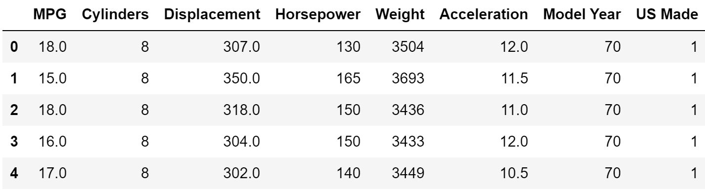

Upon inspection, it became apparent that all variables in our dataset
are numerical. However, when examining the data types of these variables
using the info() function, I observed an anomaly with the Horsepower
variable. It was identified as an object data type instead of a
numerical data type. Attempts to modify the data type encountered an
error due to the presence of the character '?' in some entries. In
addressing this issue, I conducted a search to identify the occurrences
of this character in our dataset. Subsequently, I discovered that it was
present only in the Horsepower variable, manifesting six times, thereby
causing it to be categorized as an object data type. To rectify this, I
replaced these characters with NaN values.

Continuing the examination of the dataset, a further analysis revealed
the presence of null values, which were exclusively confined to the
Horsepower column.

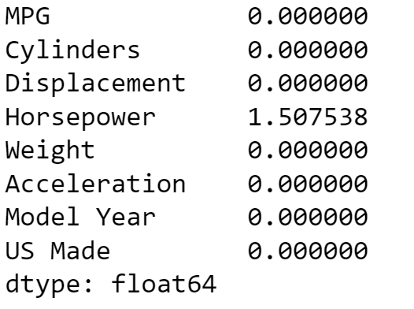

Given that only 1.5% of the data in the Horsepower column was missing,
and considering the relatively small size of the dataset, I opted to
employ the K-Nearest Neighbors (KNN) algorithm for imputing the missing
values due to its proven accuracy.

After completing this process and ensuring that all gaps were filled, I
conducted a check for duplicate rows in the dataset, and no duplicates
were identified.**MPG**

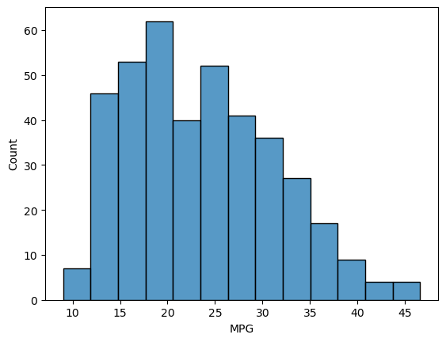
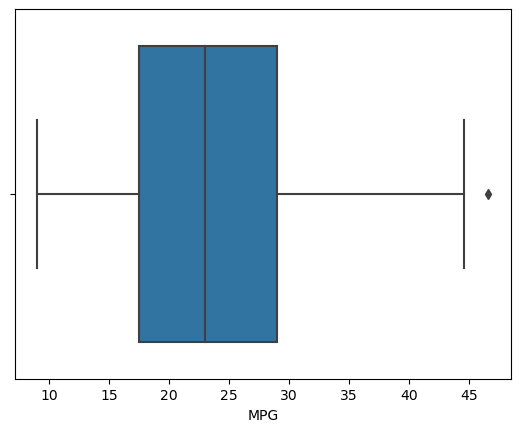

MPG stands for "Miles Per Gallon," and it is a unit of measurement used
to quantify the fuel efficiency of a vehicle. Specifically, it
represents the distance (in miles) a vehicle can travel on one gallon of
fuel. The higher the MPG value, the more fuel-efficient the vehicle is
considered. That’s why we are considering MPG as our dependent variable.

Upon examining the histogram and boxplot of the target variable, MPG
(Miles Per Gallon), it is apparent that the distribution is relatively
uniform. The majority of the data falls within the range of 19 to 30,
with a maximum value observed at 46.6, a minimum at 11, and a mean value
of 24.575. Given that MPG serves as our target variable, we have chosen
not to perform any outlier treatment, despite the presence of outliers
in the boxplot.

**Cylinders**

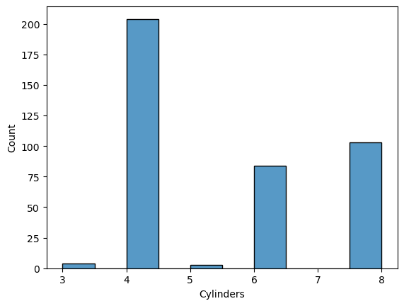
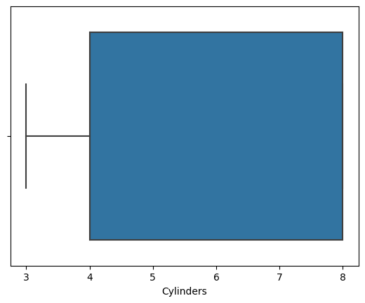

In car dataset, the attribute "cylinders" typically refers to the number
of cylinders present in the engine of a vehicle. A cylinder is a key
component of an internal combustion engine, where fuel combustion occurs
to generate power and drive the vehicle.

The predominant number of cylinders in the observed cars was 4, with a
notable presence of 8 and 6 cylinders as well. Instances of 3 and 5
cylinders were relatively rare. The mean number of cylinders across the
dataset is calculated to be 5.45.

**Displacement**

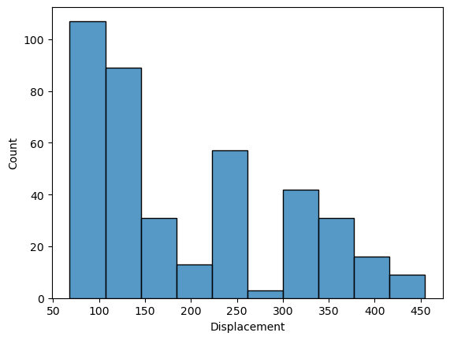
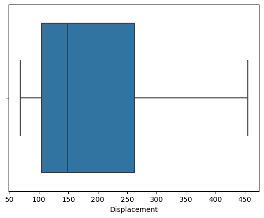

Displacement refers to the total volume of all the cylinders in the
engine. Displacement is a crucial parameter that provides insights into
the size and capacity of the engine.

The average total volume of all cylinders in the dataset is recorded at
193.42. The maximum cylinder volume observed is 455, while the minimum
is 68.

**Horsepower**

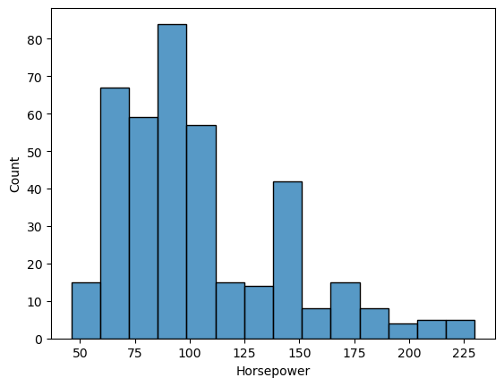
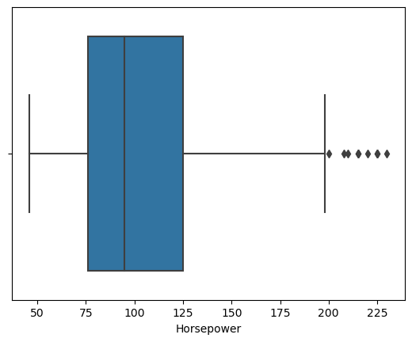

Horsepower (HP) is a unit of power that quantifies the rate at which
work is done or energy is transferred. In the context of automobiles,
horsepower is commonly used to measure the power output of an engine,
indicating its ability to perform work and generate force to propel the
vehicle.

The Horsepower variable exhibits a range between 46 and 200, as
indicated by the boxplot, with a few outliers extending up to 230. The
mean Horsepower is calculated at 104.46.

In order to enhance the accuracy of our model, we have decided to
address these outliers by removing them.

**Weight**

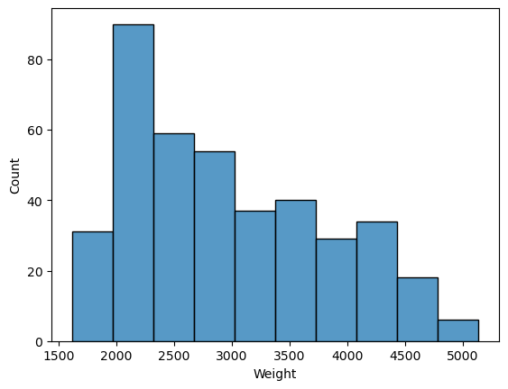
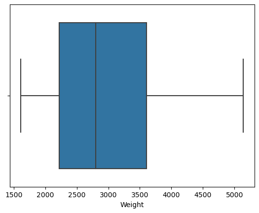

Weight refers to the mass of a vehicle, including all its components,
passengers, and cargo. The weight of a car is typically measured in
various units, such as pounds (lbs) or kilograms (kg), depending on
regional conventions.

The weight of a vehicle plays a crucial role in influencing its overall
performance, fuel efficiency, handling, and safety. In our dataset, the
average weight of vehicles is recorded at 2970.42. The maximum weight
observed is 5140, while the minimum weight is 1613.

**Acceleration**

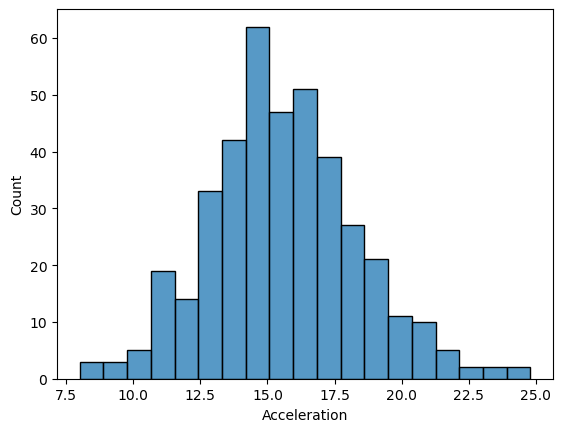
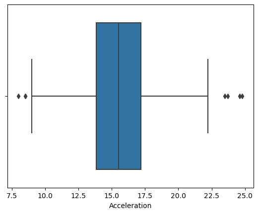

Acceleration, in the context of automobiles, refers to the rate of
change of velocity or speed over time. It is a crucial performance
metric that quantifies how quickly a vehicle can increase its speed.
Acceleration is typically measured in units like meters per second
squared (m/s²) or in terms of speed increase over a specific time
period, such as 0 to 60 miles per hour (0-60 mph).

The histogram plot of acceleration suggests a relatively uniform
distribution, with an average acceleration of 15.56. The observed range
includes a maximum acceleration of 24.8 and a minimum of 8. However,
outliers have been identified in the box plot graph. In the pursuit of
improved accuracy, these outliers will be removed in the subsequent
steps.

Top of Form

**Model Year**

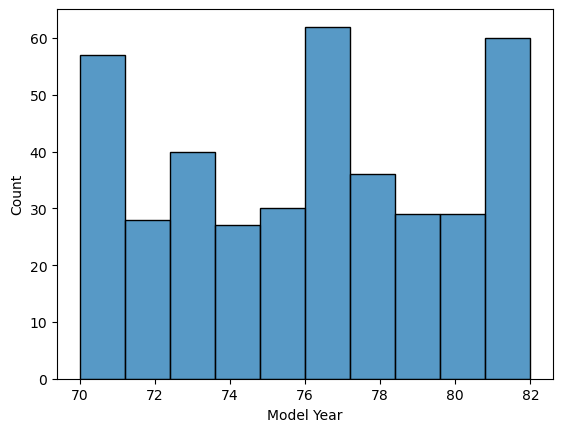
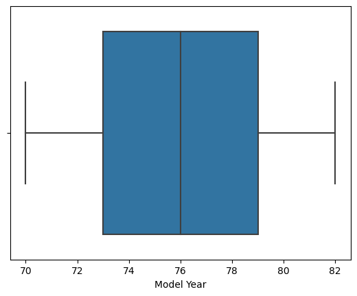

Model Year refers to the specific production year in which a particular
vehicle model is manufactured or released by the automotive
manufacturer. Each year, car manufacturers introduce new models or
update existing ones to incorporate design changes, technological
advancements, and improvements in performance, safety, and features.

The average model year is 76 with a max of 82 and a min of 70.

**US Made**

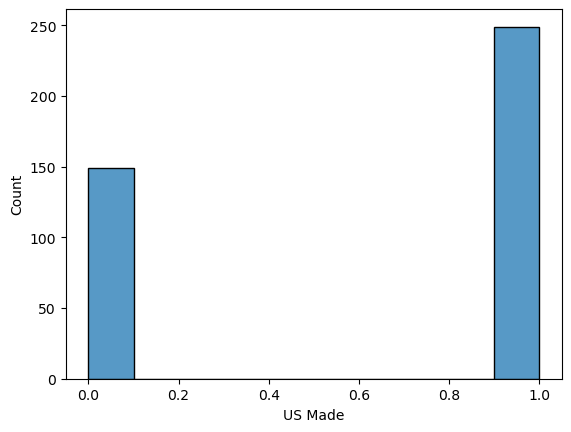

The term "US made" or "Made in the USA" refers to products, including
automobiles, that are manufactured or assembled within the geographical
boundaries of the United States. When applied to cars, "US made"
indicates that the vehicle is produced or assembled in the United
States, either entirely or with a significant portion of its
manufacturing processes taking place within the country.

US made is binary variable with 1 as made in USA and 0 as not made in
USA.

Correlation Matrix

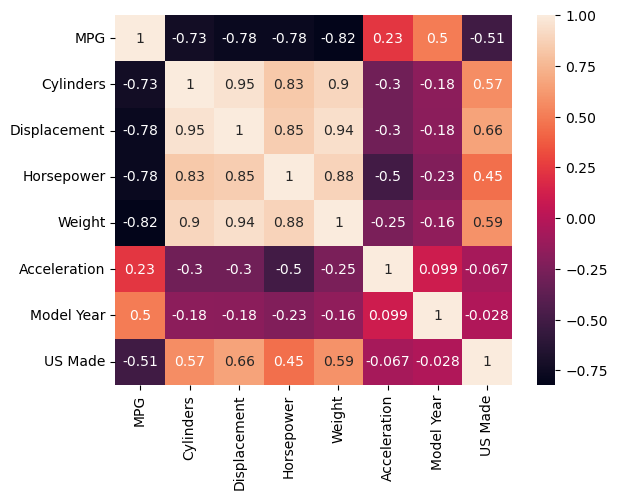

The correlation matrix analysis reveals a notable correlation between
the target variable and certain independent variables. Additionally,
there is a substantial correlation observed among independent variables,
indicating signs of multicollinearity.

In addressing multicollinearity concerns, a Variance Inflation Factor
(VIF) analysis was conducted with a predefined threshold set at 10 for
independent variables. This approach helps in managing multicollinearity
and ensuring the stability of the regression model.

# Model Development and Evaluation

In the initial stages of model development, the independent variable was
denoted as X, representing the predictors, while the dependent variable
was designated as y. The dataset was subsequently split into training
and testing sets, with 80% allocated for training and 20% for testing
purposes.

To construct the multiple regression model, the Ordinary Least Squares
(OLS) method was employed, fitting the model to the training data. This
method is utilized to estimate the coefficients of the model by
minimizing the sum of squared differences between the observed and
predicted values.

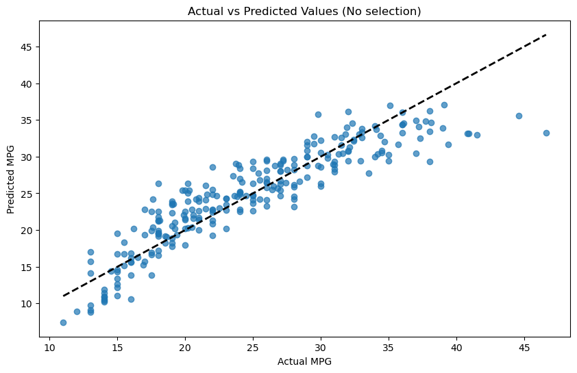

Before the analysis VIF analysis and outlier treatment was conducted on
the before mentioned variables wherever it was needed.  
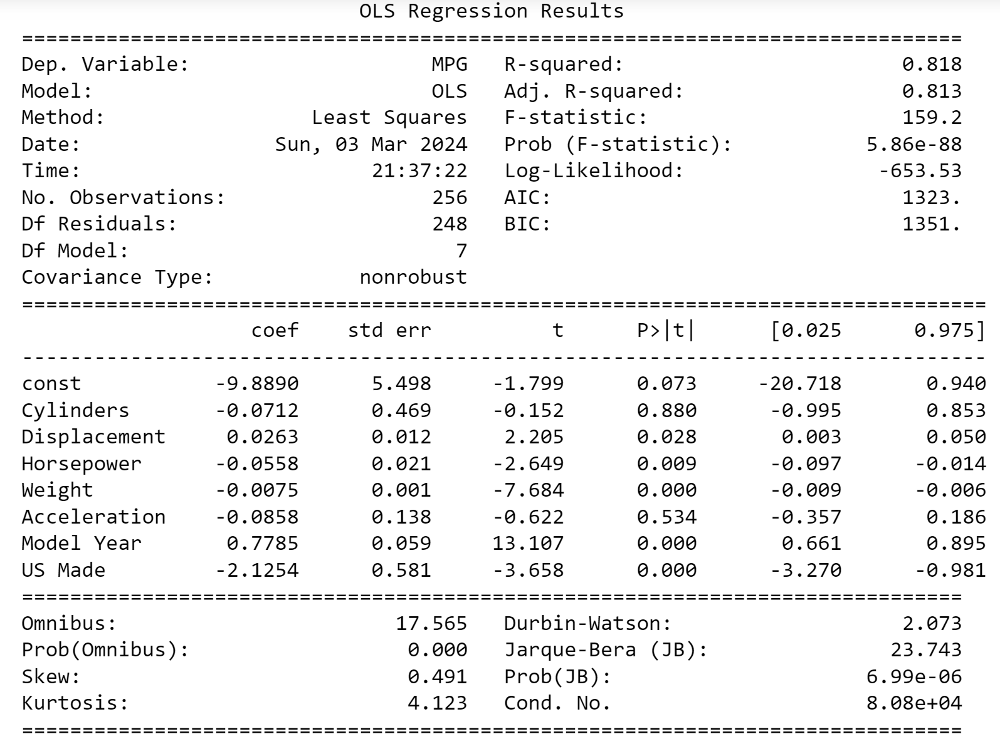

The Ordinary Least Squares (OLS) regression results showcase the model's
performance in predicting fuel efficiency (MPG) based on seven
independent variables (Cylinders, Displacement, Horsepower, Weight,
Acceleration, Model Year, and US Made).

- **R-squared:** The coefficient of determination (R-squared) is 0.818,
  indicating that approximately 81.8% of the variance in the dependent
  variable (MPG) is explained by the model.

- **Coefficients (coef):** Each coefficient represents the estimated
  change in MPG for a one-unit change in the corresponding independent
  variable, while holding other variables constant. For example, a
  one-unit increase in Weight results in a decrease of approximately
  0.0075 units in MPG.

- **P-values (P\>\|t\|):** The p-values assess the statistical
  significance of each coefficient. Notably, variables with p-values
  below the conventional threshold of 0.05 (such as Displacement,
  Horsepower, Weight, and Model Year) are considered statistically
  significant predictors of MPG.

- **AIC:** The AIC is a statistical metric used for model evaluation. In
  our regression results, the AIC value of 1323 is derived from the
  likelihood function and the number of parameters in the model. A lower
  AIC is preferred as it suggests a more effective model in terms of
  explaining the data while considering model complexity. When comparing
  models, the one with the lowest AIC is typically favored, reflecting a
  better compromise between explanatory power and simplicity.

# The graphical representation of the Actual MPG versus Predicted MPG demonstrates that the model is generally accurate in its predictions. The best fit line aligns closely with the actual values, and there is minimal deviation between the actual and predicted points. This observation indicates a good alignment between the model's predictions and the true values, suggesting that the model is capable of making accurate predictions for the given dataset.

# Comparison with various Selection Model

| Model                | R - squared | MSE    | RMSE  | AIC      |
|----------------------|-------------|--------|-------|----------|
| No Selection         | 0.818       | 9.658  | 3.108 | 1323.052 |
| Stepwise Selection   | 0.818       | 9.675  | 3.110 | 1319.491 |
| Forward Selection    | 0.818       | 9.675  | 3.110 | 1319.491 |
| Backward Elimination | 0.818       | 9.675  | 3.110 | 1319.491 |
| Manual Selection     | 0.803       | 10.476 | 3.237 | 1333.862 |

The analysis of various models, considering factors like R-squared, Mean
Squared Error (MSE), Root Mean Squared Error (RMSE), and Akaike
Information Criterion (AIC), provides valuable insights into the model
performance and the impact of variable treatments.

When we kept all the variables in model and was without VIF and outlier
treatment the r – squared values were 0.82 but the AIC values were 1690.
After the treatments we saw a drastic change in the AIC values which
came down to 1323.05 as AIC shows a more effective model in terms of
explaining the data while considering model complexity.

The Mean Squared Error (MSE) and Root Mean Squared Error (RMSE) values
are comparable across all models, hovering around 9.675 and 3.110,
respectively. These metrics quantify the accuracy of predictions, with
lower values reflecting better model performance.

The Akaike Information Criterion (AIC) serves as a measure for model
comparison, considering both fit and complexity. Models generated
through feature selection methods (Stepwise, Forward, Backward) present
lower AIC values (1319.491) compared to the No Selection model
(1323.052). This suggests that the selected feature models offer a more
efficient trade-off between explaining the data and avoiding unnecessary
complexity.

In the context of our primary research, evaluating the significance of
variables through the examination of coefficients and p-values is
imperative. Lower p-values signify increased significance of variables
within the model summaries. Variations in variable significance become
apparent when comparing coefficients and p-values across different
models.

Analyzing the implications for our research, the similarity in R-squared
values across models indicates that they effectively capture a
comparable amount of variation in the target variable. The decision on
which model to choose should align with the specific goals of our
analysis. If interpretability is a priority, opting for a model with
fewer features, denoted by a lower AIC, would be a favorable choice.
This approach ensures a better balance between model explanation and
complexity, enhancing the overall interpretability of our research
findings.

# Manual Selection

Manual selection is the variable with two selected variable which are
the key variable for the business and that is Weight and Model Year
gives out R-squared of 0.803 and AIC of 1344 which very near to that of
all other models.

**Weight**

The inclusion of the "Weight" variable in the regression model is
justified by its statistical significance and real-world intuition. The
negative coefficient and highly significant p-value suggest that as the
weight of a car increases, the predicted miles per gallon (MPG)
decreases. This aligns with the practical understanding that heavier
cars generally require more energy to move and, consequently, have lower
fuel efficiency. For the business, focusing on weight reduction in
vehicle design becomes imperative. Strategies such as incorporating
lightweight materials and optimizing structural elements can not only
positively impact fuel efficiency but also position the company as
environmentally conscious and responsive to consumer preferences for
eco-friendly automobiles.

**Model Year**

The inclusion of the "Model Year" variable is substantiated by its
statistically significant positive coefficient and highly significant
p-value. This indicates that newer model years are associated with
higher predicted MPG. This relationship underscores the influence of
technological advancements, improved engine efficiency, and adherence to
evolving emission standards in newer car models. For the business,
concentrating on the model year as a factor affecting fuel efficiency
opens avenues for strategic product development. Embracing the latest
technologies and incorporating design innovations in newer models not
only enhances MPG but also aligns with consumer expectations for
cutting-edge features. This focus positions the company competitively,
catering to a market increasingly inclined toward technologically
advanced and environmentally friendly vehicles.

# Recommendations

The analysis of key variables, "Weight" and "Model Year," provides
valuable insights for strategic recommendations to the car manufacturing
business. Firstly, a concerted effort should be directed towards weight
reduction in vehicle design. This involves prioritizing innovative
materials and manufacturing processes to create lighter structures
without compromising safety. The integration of lightweight materials,
both internally and externally, is essential to achieving improved fuel
efficiency.

Secondly, the business should focus on continuous technological
advancements and model innovation. Emphasizing cutting-edge features and
enhancements in engine efficiency with each new model year is crucial.
Staying informed about industry trends and customer preferences ensures
that the company integrates sought-after features, positioning itself as
a leader in technological advancements.

The emphasis on weight reduction and improved fuel efficiency provides
an opportunity for the business to position itself as environmentally
conscious. Communicating the adoption of sustainable practices and
materials can resonate with eco-conscious consumers, contributing to a
positive brand image.

In parallel, consumer education initiatives should be developed to
convey the impact of weight on fuel efficiency. This approach helps
consumers make informed decisions when selecting vehicles and highlights
the company's commitment to transparency and consumer awareness.

To stay at the forefront of industry advancements, the business should
allocate resources for ongoing research and development. Collaborations
with research institutions and industry partners can facilitate access
to the latest technologies in vehicle design, ensuring the company
remains competitive and innovative.

Comprehensive testing and validation processes are paramount to
guaranteeing the optimal balance between weight reduction and structural
integrity. Rigorous testing protocols should be implemented to ensure
that safety standards are not compromised in pursuit of enhanced fuel
efficiency.

In summary, the strategic implementation of these recommendations can
position the car manufacturing business as a leader in eco-friendly and
technologically advanced vehicles. By focusing on weight reduction,
innovation, sustainability, consumer education, and ongoing research,
the company can enhance its competitive edge, meet evolving consumer
expectations, and contribute to the broader goals of sustainability in
the automotive industry.

# Conclusion

In conclusion, this research endeavors to enhance our understanding of
factors influencing fuel efficiency in automobiles and offers valuable
insights for a car manufacturing business. Through a comprehensive
analysis of various models and variables, the study highlights the
significance of weight and model year in predicting miles per gallon
(MPG). The strategic recommendations derived from this analysis center
around weight reduction strategies, continuous technological
advancements, eco-friendly positioning, consumer education, and
investment in research and development. Implementing these
recommendations can not only improve fuel efficiency but also position
the business competitively in the automotive industry. The findings
emphasize the delicate balance between innovation, sustainability, and
consumer awareness in shaping the future of vehicle design. As the
automotive landscape evolves, embracing these strategies can contribute
to both environmental sustainability and the company's long-term
success.

# References

Research, H. A. (2020, June 10). *Car Specs Explained*. Car And Driver.
<https://www.caranddriver.com/research/a32813947/car-specs/>

G. (2023, January 25). *ML  Multiple Linear Regression using Python*.
GeeksforGeeks.
<https://www.geeksforgeeks.org/ml-multiple-linear-regression-using-python/>
